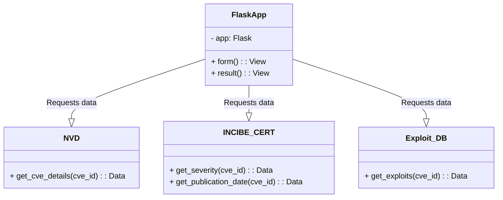
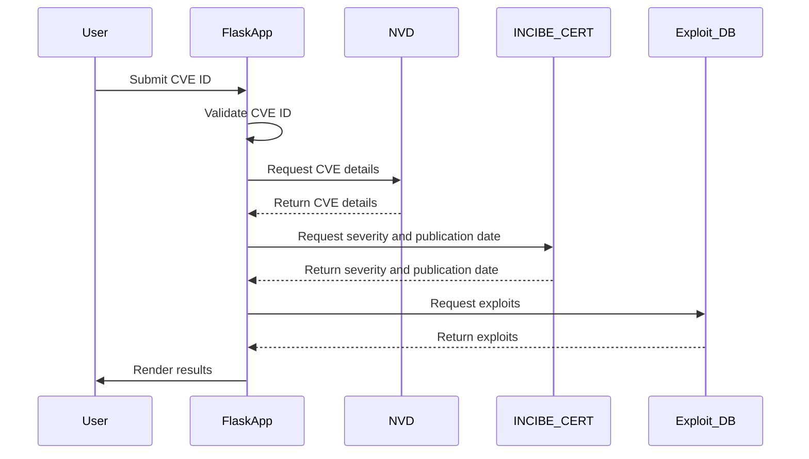
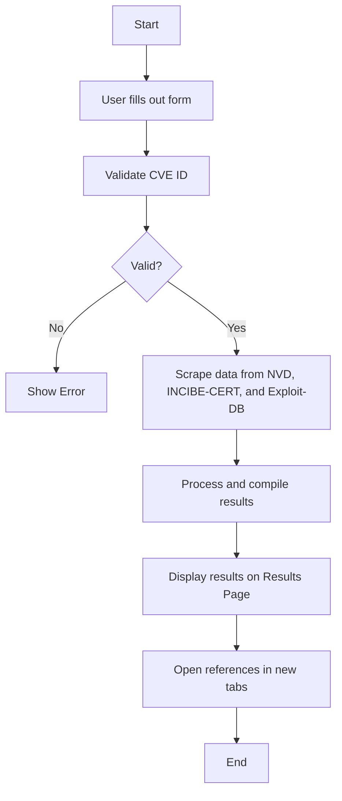

# CVE Reports

The **CVE Reports** is a web-based tool designed to help users retrieve and display detailed information about specific CVEs (Common Vulnerabilities and Exposures). By inputting a CVE ID, users can access information from multiple sources, including the National Vulnerability Database (NVD), INCIBE-CERT, and Exploit-DB. The application performs validation on the CVE ID, scrapes relevant data, and presents it in a user-friendly format. Additionally, it opens multiple references in new tabs for further investigation.


# Dependencies

The project requires the following Python packages:

  

-  `Flask`: A lightweight WSGI web application framework.

-  `Requests`: A simple HTTP library for making requests to web services.

-  `BeautifulSoup4`: A library for parsing HTML and XML documents.

-  `pandas`: Data manipulation and analysis library.

-  `Selenium`: A tool for automating web browser interaction.

-  `webdriver-manager`: Automatically manages WebDriver binaries.


  

To install these dependencies, you can use the provided `requirements.txt` file.

## Instructions for Running the Project
1.  **Install the required packages:**

  

```bash

pip install -r requirements.txt

```

  

Create a `requirements.txt` file with the following content:

  

```text

Flask

requests

beautifulsoup4

pandas

selenium

webdriver-manager

```
2.  **Run the Flask application:**

  

```bash

python app.py

```

  

3.  **Open a web browser and navigate to:**

  

```

http://127.0.0.1:9000/

```

  

Use the provided form to input a CVE ID and submit. The application will process the CVE ID and display the results.


## Group Members and Roles

-  **Bakhtiyar Qadimov**: Project Lead , Backend Developer - Handles the Scraping, Download link from ExploitDB, Flask integration.

-  **Sabina Ismikhanova**: Backend Developer - Validate CVE-ID format, validate the year,the number part. Check if CVE exist or not. Check if CVE Reserved , Rejected or Disputed.

-  **Gunel Khanaliyeva**: Frontend Developer - Designs and implements the HTML templates- form.html,result.html structure of result page and form page.

-  **Orkhan Aliyev**: Quality Assurance - Ensuring hyperlink not broken. Open the hyperlinks in NIST.

## Additional Instructions or Comments
UML diagrams

Below are the UML diagrams that describe the design and workflow of the application:






